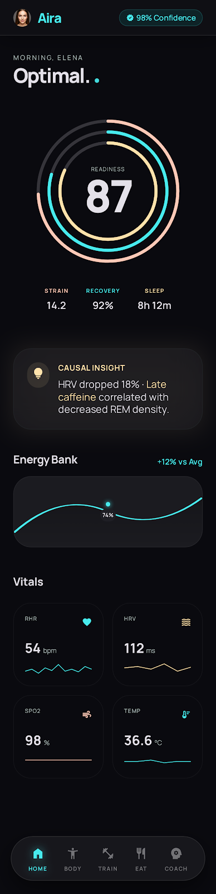
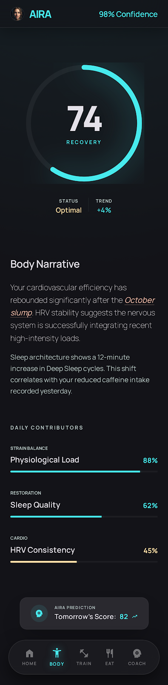
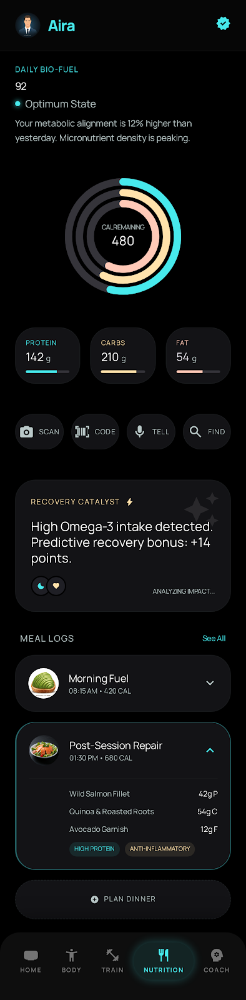
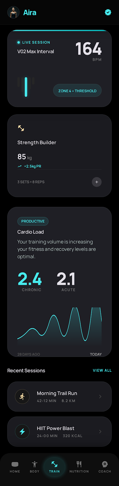

# Aira

<div align="center">
  <p><strong>A privacy-first, on-device health intelligence OS for Android.</strong></p>
  
</div>

<p align="center">
  <a href="#features">Features</a> •
  <a href="#tech-stack">Tech Stack</a> •
  <a href="#privacy--security">Privacy & Security</a> •
  <a href="#download">Download</a> •
  <a href="#contributing">Contributing</a> •
  <a href="#faq">FAQ</a>
</p>

---

## What is Aira?

**Aira** is a privacy-first, on-device health intelligence OS for Android that aggregates wearable and phone sensor data, learns your unique physiology over time, and converts noisy raw data into accurate, explainable daily scores with causal reasoning. 

It is designed to be Android-first, built natively with **Jetpack Compose**, integrating deeply with **Health Connect** and **Google Fit**.

**Core Value:** Empower Android users with true on-device, explainable health intelligence that learns their unique physiology without compromising their privacy or requiring their raw biome data to leave the device.

## Screenshots

<p align="center">
  
  
  
  
</p>

## Features

- **On-Device AI Intelligence:** Powered by local models (MediaPipe GenAI & TensorFlow Lite) for generating custom health narratives and insights directly on your device.
- **Explainable Scores:** Understand exactly *why* your daily scores are what they are through causal reasoning.
- **Deep Health Connect Integration:** Seamlessly syncs with Health Connect to become the single source of truth for your health and fitness data.
- **Complete Privacy Isolation:** Your raw biometric data stays on your device. It is secured via SQLCipher and never transmitted to the cloud. Only aggregate scores and narratives can sync (if explicitly opted-in).
- **Responsive Native UI:** Beautiful, smooth, and dynamic UI crafted entirely with Jetpack Compose.
- **Personalized Adjustments:** Employs an on-device anomaly detector and PersonalisedScoreAdjuster that adapts to your physiological baselines over time.

## Tech Stack

We heavily rely on modern Android development practices to ensure performance and long-term maintainability:
- **Language:** 100% Kotlin (2.0.0+)
- **UI Toolkit:** Jetpack Compose (BOM 2024.10.x)
- **Local Storage:** Room Database with **SQLCipher** for encryption
- **Cloud Storage:** Firebase Realtime DB (for opt-in metrics/scores sync with strict RLS)
- **Machine Learning:** TensorFlow Lite & MediaPipe Tasks GenAI (Gemma 4 2B)
- **Health Data:** Health Connect API (Primary)
- **Architecture & DI:** Clean Architecture + MVVM, powered by Hilt
- **Background Tasks:** WorkManager
- **Serialization:** kotlinx.serialization

## Privacy & Security

We believe your health data is uniquely yours. 
- **Zero Cloud Processing:** Transmitting raw bio-data off device breaks our privacy-first promise. We execute LLM inference and anomaly detection completely locally.
- **Encrypted Persistence:** All on-device biometric persistence is encrypted at rest.
- **Opt-In Sync:** If enabled, Firebase only receives computed, de-identified metrics and text-based AI narratives—never raw data points.

## Download

### Stable Release
Available on the Google Play Store (coming soon). Requires Android 10 (minSdk 29) or higher.

### Nightly Build
You can find the latest debug APKs in the [Releases](https://github.com/ren276/Aira/releases) section or compile it directly from the `main` branch.

---

## Contributing

We are thrilled to welcome new contributors! Whether you are fixing a bug, writing documentation, or implementing a core feature, your help is appreciated. 

### Prerequisites
- Android Studio Ladybug (or the latest stable version)
- Kotlin 2.0.0+
- A physical Android device or Emulator running API level 29+ with Health Connect installed.

### Getting Started

1. **Fork the Repository:**
   Click the "Fork" button at the top right of this page to create a copy of the project in your own account.

2. **Clone your Fork:**
   ```bash
   git clone https://github.com/YOUR-USERNAME/Aira.git
   cd Aira
   ```

3. **Open the Project:**
   Open Android Studio and select `Open an Existing Project`. Navigate to the cloned `Aira` directory. Let Gradle sync completely.

4. **Add Upstream Remote (Optional but Recommended):**
   ```bash
   git remote add upstream https://github.com/ren276/Aira.git
   ```

### Project Structure & Architecture
Aira strictly follows **Clean Architecture** patterns separated into modules or clearly defined packages:
- `data/`: Repositories, Room DAOs, Data Sources (Local/Remote), Firebase Integrations.
- `domain/`: Use cases, Entities, and Business Logic (Agnostic of framework components).
- `presentation/`: ViewModels, Jetpack Compose UI logic, and State Management.
- `ai/`: On-device AI processing wrappers (TFLite, MediaPipe)

*Note: Ensure UI logic stays inside `presentation` and avoid leaking Android frameworks into the `domain` layer.*

### Guidelines for Contributors
- **GSD Workflow Enforcement:** This project uses an AI agent workflow structure (`.planning/`). When exploring architecture decisions or opening major PRs, check existing `GSD` specifications.
- **Code Style:** We follow standard Kotlin conventions. Please run the IDE reformatting and standard Lint checks before committing.
- **Branch Naming:** Use descriptive branch names: `feature/health-connect-sync`, `bugfix/ui-spinner-crash`, `docs/readme-update`.
- **Commit Messages:** Write clear, concise commit messages. (e.g., `Fix: resolve loading spinner infinite loop in dashboard`)
- **Pull Requests:** Open a PR against the `main` branch. Provide screenshots/videos if making UI changes. Tag relevant issues.

## FAQ

**Q: Why Health Connect and not Google Fit APIs?**
A: Google Fit REST APIs are deprecated for biometric reads. Health Connect is the modern, secure Android standard and serves as our single source of truth.

**Q: How does the AI inference work locally?**
A: We use MediaPipe Tasks GenAI optimized for the Gemma 2B model directly on device. The model weights are downloaded dynamically on the first run rather than bundled inside the APK.

## Translations

Help us bring Aira to more people! Translation links will be provided here in the future.

## Support the Project

If Aira brings you joy or helps you manage your health better, consider giving us a ⭐ on GitHub and spreading the word!

## Contributors

This project wouldn't exist without these amazing people! Check out the [Contributors Graph](https://github.com/ren276/Aira/graphs/contributors).

---
*Disclaimer: Aira provides insights and summaries based on physiological data but is not a substitute for professional medical advice, diagnosis, or treatment. Always seek the advice of your physician.*
